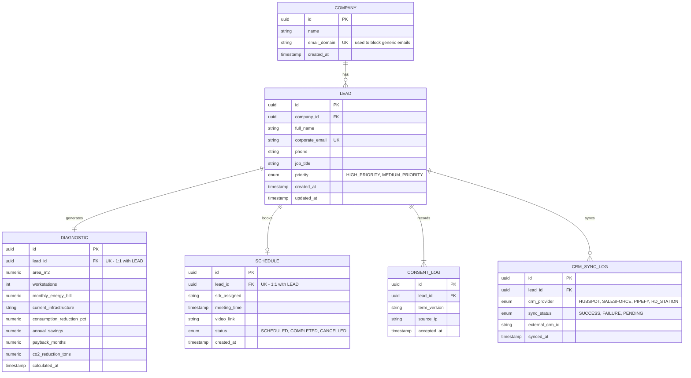

# Data Model — Lumina Tech Labs

Entity-Relationship Diagram (ERD) for the lead capture, diagnostic, and qualification platform, including primary keys (PK), foreign keys (FK), and the main constraints for each entity.

## Entity-Relationship Diagram

## Entity Details

### COMPANY

Represents the lead's company, derived from the corporate email domain.

| Field | Type | Key | Notes |
| --- | --- | --- | --- |
| `id` | uuid | PK | Company identifier |
| `name` | string | — | Provided in the form |
| `email_domain` | string | UK (unique) | e.g., `company.com`; used to group leads from the same company and block generic domains |
| `created_at` | timestamp | — | Date of the company's first lead |

**Relationship:** 1 `COMPANY` → N `LEAD`.

---

### LEAD

The core entity — the visitor who filled out the unlock form.

| Field | Type | Key | Notes |
| --- | --- | --- | --- |
| `id` | uuid | PK | Lead identifier |
| `company_id` | uuid | FK → `COMPANY.id` | Associated company |
| `full_name` | string | — | Required |
| `corporate_email` | string | UK (unique) | Lead deduplication key |
| `phone` | string | — | Business phone/WhatsApp |
| `job_title` | string | — | Role at the company |
| `priority` | enum | — | `HIGH_PRIORITY` / `MEDIUM_PRIORITY`, set by the scoring engine |
| `created_at` / `updated_at` | timestamp | — | Audit fields |

**Relationships:** 1:1 with `DIAGNOSTIC`, 0:1 with `SCHEDULE`, 1:N with `CONSENT_LOG`, 1:N with `CRM_SYNC_LOG`.

---

### DIAGNOSTIC

The savings/ROI calculation result linked to a lead (a **1:1** relationship — each lead has exactly one official diagnostic).

| Field | Type | Key | Notes |
| --- | --- | --- | --- |
| `id` | uuid | PK | Diagnostic identifier |
| `lead_id` | uuid | FK (UK) → `LEAD.id` | Enforces 1:1 with the lead |
| `area_m2` | numeric | — | Visitor input |
| `workstations` | int | — | Visitor input — also used in scoring |
| `monthly_energy_bill` | numeric | — | Visitor input — also used in scoring |
| `current_infrastructure` | string | — | e.g., LED, centralized HVAC, presence sensors |
| `consumption_reduction_pct` | numeric | — | Calculated result |
| `annual_savings` | numeric | — | Calculated result |
| `payback_months` | numeric | — | Calculated result |
| `co2_reduction_tons` | numeric | — | Calculated result |
| `calculated_at` | timestamp | — | — |

---

### CONSENT_LOG

Immutable (append-only) record of terms acceptance, required for data protection compliance. A lead can have more than one record if terms are re-accepted after an update.

| Field | Type | Key | Notes |
| --- | --- | --- | --- |
| `id` | uuid | PK | — |
| `lead_id` | uuid | FK → `LEAD.id` | — |
| `term_version` | string | — | Version of the Terms of Use/Privacy Policy accepted |
| `source_ip` | string | — | IP captured at the time of acceptance |
| `accepted_at` | timestamp | — | Never updated or deleted |

---

### SCHEDULE

The diagnostic meeting booking (a **0:1** relationship with `LEAD` — not every lead books a meeting).

| Field | Type | Key | Notes |
| --- | --- | --- | --- |
| `id` | uuid | PK | — |
| `lead_id` | uuid | FK (UK) → `LEAD.id` | One booking per lead |
| `sdr_assigned` | string | — | Assigned consultant |
| `meeting_time` | timestamp | — | Confirmed date/time |
| `video_link` | string | — | Meet/Teams/Zoom link |
| `status` | enum | — | `SCHEDULED` / `COMPLETED` / `CANCELLED` |
| `created_at` | timestamp | — | — |

---

### CRM_SYNC_LOG

History of lead synchronizations with the external CRM (a lead may be synced more than once, e.g., a retry after failure).

| Field | Type | Key | Notes |
| --- | --- | --- | --- |
| `id` | uuid | PK | — |
| `lead_id` | uuid | FK → `LEAD.id` | — |
| `crm_provider` | enum | — | `HUBSPOT` / `SALESFORCE` / `PIPEFY` / `RD_STATION` |
| `sync_status` | enum | — | `SUCCESS` / `FAILURE` / `PENDING` |
| `external_crm_id` | string | — | ID of the record created in the CRM |
| `synced_at` | timestamp | — | — |

## Cardinality Summary

| Relationship | Cardinality |
| --- | --- |
| COMPANY → LEAD | 1 : N |
| LEAD → DIAGNOSTIC | 1 : 1 |
| LEAD → SCHEDULE | 1 : 0..1 |
| LEAD → CONSENT_LOG | 1 : N |
| LEAD → CRM_SYNC_LOG | 1 : N |