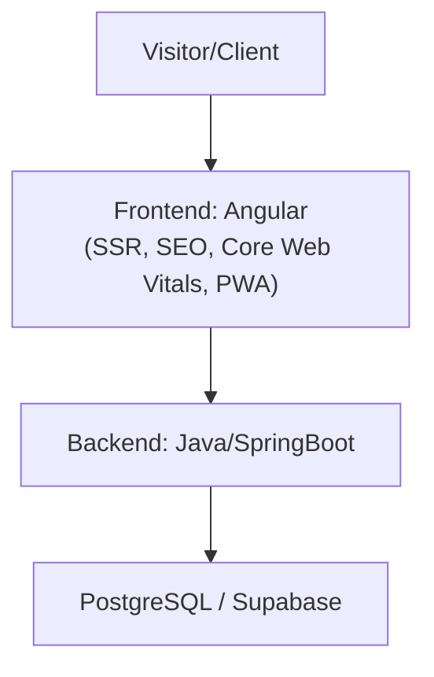

# Requirements Document

**Project:** Lead Capture, Interactive Diagnostic, and Qualification Platform 
**Company:** Lumina Tech Labs 
**Version:** 1.0 
**Date:** September 19, 2026

---

## 1. Overview and Proposed Architecture

To solve the B2B funnel conversion bottleneck at **Lumina Tech Labs**, the proposed solution combines a **High-Performance Interactive Landing Page** with a **Robust Microservices/API Ecosystem**.

The strategy focuses on replacing the passive contact model with a **value-based capture tool (Interactive Lead Magnet)**: the visitor enters metrics about their space and immediately receives an ROI/savings report, while the sales team gets a pre-qualified lead ready for scheduling.

---

## 2. Functional Requirements (FR)

### FR01 — Interactive Savings Calculator and Diagnostic (Frontend)

- **FR01.1 — Data Input:** The system must provide a dynamic interface for the visitor to enter:
  - Total area of the corporate space (m²).
  - Number of workstations / occupied seats.
  - Average monthly electricity bill (R$).
  - Current infrastructure type (e.g., LED lighting, centralized HVAC control, presence sensors).
- **FR01.2 — Dynamic Estimate Calculation:** The system must instantly calculate, via parameterizable logic:
  - Estimated energy consumption reduction (% and R$/year).
  - Estimated payback period for the automation investment (in months).
  - Projected carbon footprint reduction (tCO2/year).
- **FR01.3 — Unlock Form (Gated Content):** To unlock the detailed report and PDF download, the visitor must provide:
  - Full name.
  - Corporate email (with business domain validation, blocking generic emails such as @gmail.com or @hotmail.com).
  - Business phone / WhatsApp number.
  - Job title / role at the company.
  - Company name.

### FR02 — Smart Scheduling of Diagnostic Meeting

- **FR02.1 — Post-Capture Scheduling Flow:** After submitting the diagnostic form (or via a direct CTA button on the page), the system must display an interactive grid of available sales team time slots.
- **FR02.2 — Calendar Integration:** The module must integrate with calendar providers (Google Calendar / Microsoft Outlook) to sync availability in real time and prevent double booking.
- **FR02.3 — Automatic Confirmation:** Upon booking, the system must issue a meeting invite containing the video conference link (Google Meet / Teams / Zoom) to both the lead and the assigned consultant.

### FR03 — Backend Engine for Capture, Qualification, and Integration (Java)

- **FR03.1 — Ingestion and Validation Endpoint:** Provide a `POST /api/v1/leads` endpoint in Java for synchronous processing and strict validation of incoming data.
- **FR03.2 — Automatic Qualification Rules (Scoring):**
  - Leads with more than 50 workstations or an energy bill above R$ 15,000/month receive the `HIGH_PRIORITY` tag.
  - Leads with an intermediate profile receive the `MEDIUM_PRIORITY` tag.
  - Automatic routing: `HIGH_PRIORITY` leads immediately notify the dedicated Inside Sales / SDR team.
- **FR03.3 — Instant Notification and Email Dispatch:**
  - Synchronous/asynchronous email sent to the lead with the Savings/Diagnostic Report summary attached (PDF) or an access link.
  - Immediate notification to the internal sales channel (via email, Microsoft Teams, or Slack webhook) detailing the newly qualified lead's data.
- **FR03.4 — CRM Integration (Webhooks / REST API):**
  - Automatic synchronization of lead and diagnostic data with the corporate CRM (HubSpot, Salesforce, Pipefy, or RD Station).
  - Automatic creation of the Opportunity/Deal at the initial funnel stage (Deal Creation).

---

## 3. Non-Functional Requirements (NFR)

### NFR01 — SEO & Performance

- **NFR1.1 — Angular SSR (Server-Side Rendering):** Server-side rendering to ensure fast indexing by search engines (Google Bot) and dynamic meta tags for social sharing.
- **NFR1.2 — Core Web Vitals:** Largest Contentful Paint (LCP) must be under 2.5s, and First Input Delay (FID) / Interaction to Next Paint (INP) under 200ms on standard 4G connections.

### NFR02 — Security & Data Protection (LGPD)

- **NFR2.1 — Consent Management:** Implementation of an explicit checkbox for accepting the Terms of Use and Privacy Policy, recording timestamp, IP, and accepted term version in the database.
- **NFR2.2 — Sanitization & DTO Validation:** Strict backend validation in Java using Bean Validation (`@NotNull`, `@Email`, `@Pattern`, etc.) to prevent XSS, SQL Injection, and request forgery.
- **NFR2.3 — Encryption:** Data transmission mandatorily via HTTPS/TLS 1.3, with sensitive data encrypted at rest.

### NFR03 — Scalability

- **NFR3.1 — Containerization:** Backend application packaged into optimized Docker images, ready for orchestration (Kubernetes / AWS ECS / Cloud Run) with auto-scaling support.
- **NFR3.2 — Availability & Resilience:** Support for traffic spikes from paid campaigns (Google Ads / LinkedIn Ads), maintaining 99.9% availability.