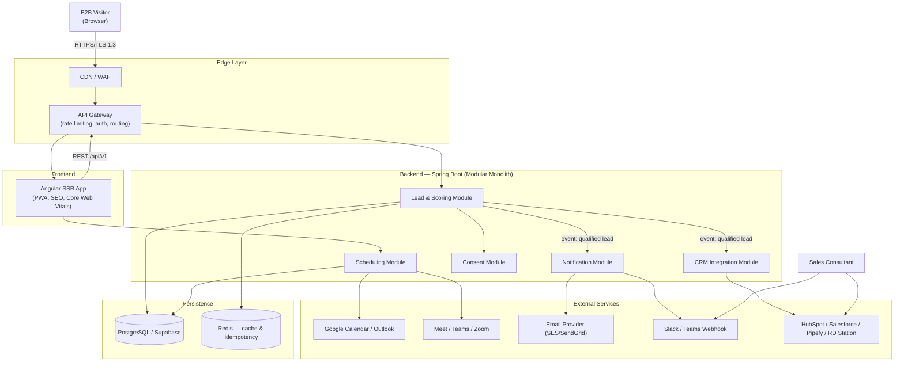
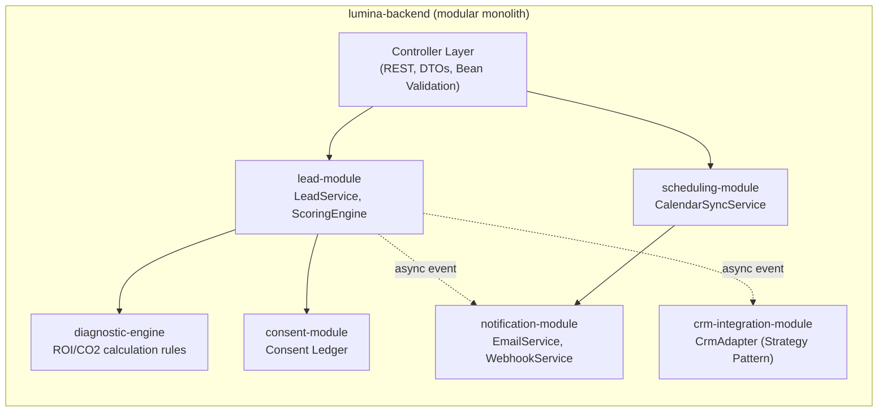
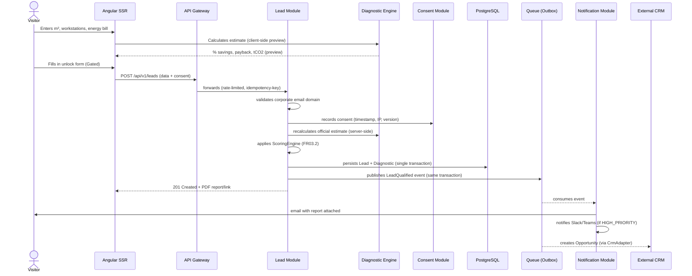
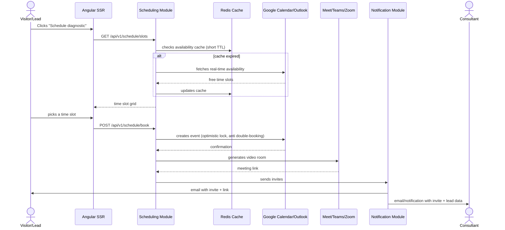
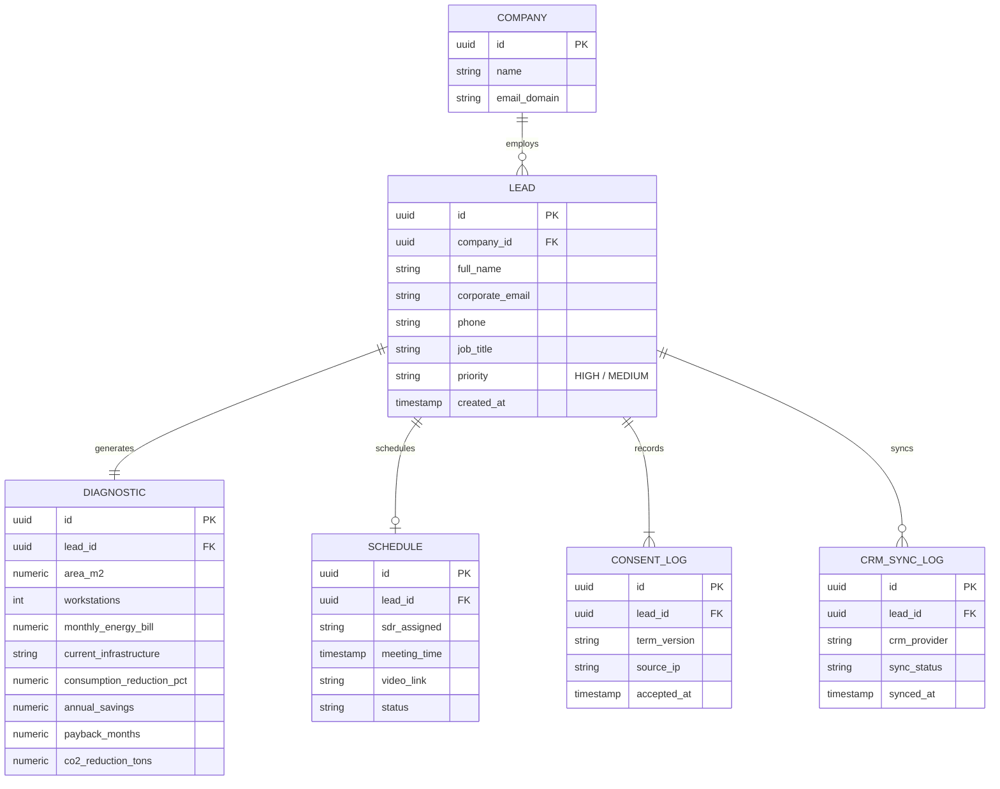

# Software Design Document

### Lead Capture, Interactive Diagnostic, and Qualification Platform — Lumina Tech Labs

**Version:** 1.0 
**Based on:** Requirements Document v1.0 (09/19/2026)

---

## 1. Goal and Architectural Approach

The requirements define three functional blocks tightly coupled by data (capture → scheduling → sales integration) and a demanding set of NFRs (SEO/performance, data protection, scalability). The core design decision is:

> **Start as a Modular Monolith in Spring Boot, with module boundaries already designed as future microservices**, exposed behind an API Gateway, rather than jumping straight into distributed microservices.

**Rationale:** the domain (lead capture → scoring → scheduling → notification → CRM) has strong transactional consistency at the moment the lead is created (FR03.1–FR03.4 happen in sequence, within the same "unit of work"). Splitting this prematurely into separate services would add operational cost (orchestration, distributed observability, eventual consistency) without real benefit at the expected volume of a B2B landing page. The modular design allows any module (e.g., Scheduling or CRM Sync) to be extracted into its own service when traffic or team size demand it, without rewriting business rules — this satisfies NFR3.1/NFR3.2 (containers, auto-scaling) without day-one overhead.

---

## 2. Container Architecture (C4 — Level 2)

**Role of each component:**

- **CDN/WAF**: caches static Angular SSR assets, mitigates DDoS/bots — supports NFR3.2.
- **API Gateway**: single entry point; applies rate limiting (protects the form from abuse) and validates JWTs for administrative routes.
- **Redis**: used for (a) caching calendar availability payloads, and (b) the idempotency key on `POST /api/v1/leads` (avoids duplicate leads from double-clicks/network timeouts).

---

## 3. Backend Module Decomposition (Spring Boot)

**Design patterns applied:**

| Module | Pattern | Why |
| --- | --- | --- |
| `diagnostic-engine` | **Strategy** | The estimation rules (FR01.2) change frequently (marketing/sales adjust the formulas); isolating them into parameterizable strategies avoids a backend deployment for every formula tweak. |
| `crm-integration-module` | **Adapter/Strategy** | FR03.4 requires support for 4 distinct CRMs; one `CrmAdapter` per provider implementing a common interface (`sendLead(LeadDTO)`) avoids tightly coupled `if/else` logic. |
| `lead-module → notification/crm` | **Outbox Pattern + async events** | FR03.2/FR03.3 must not block the HTTP response to the visitor, nor fail silently if an external CRM goes down; the event is written in the same transaction as the lead and processed via a worker/queue. |
| `consent-module` | **Append-only ledger** | NFR2.1 requires legal traceability (timestamp, IP, accepted term version) — records must never be overwritten, only inserted. |

---

## 4. Sequence Flow — Capture and Qualification (FR01 → FR03)

**Resilience points:** sending to the CRM and to the email provider happens **outside** the main HTTP transaction (via queue), with exponential retry. This way, instability in HubSpot doesn't break the visitor's experience — satisfies NFR3.2.

---

## 5. Sequence Flow — Scheduling (FR02)

---

## 6. Data Model (ER)

`CONSENT_LOG` is **append-only** (never `UPDATE`/`DELETE`) to guarantee legal defensibility under data protection law.

---

## 7. API Design (main contract)

| Method | Endpoint | Description | FR |
| --- | --- | --- | --- |
| `POST` | `/api/v1/leads` | Lead + diagnostic + consent ingestion (idempotent via `Idempotency-Key` header) | FR01.3, FR03.1 |
| `GET` | `/api/v1/diagnostics/preview` | Client-side preview calculation (not persisted, not gated) | FR01.2 |
| `GET` | `/api/v1/schedule/slots?consultantId=` | Lists available time slots (cached) | FR02.1 |
| `POST` | `/api/v1/schedule/book` | Confirms booking + generates video room | FR02.2, FR02.3 |
| `GET` | `/api/v1/leads/{id}/report` | Downloads the diagnostic PDF | FR01.3 |

All input DTOs use Bean Validation (`@NotNull`, `@Email`, `@Pattern` to block generic domains), per NFR2.2.

---

## 8. Security and Data Protection (NFR02)

- **Transport:** TLS 1.3 required end-to-end (CDN → Gateway → Backend).
- **At rest:** sensitive columns (`corporate_email`, `phone`) encrypted at the column level (`pgcrypto` in Postgres/Supabase).
- **Input validation:** Bean Validation in the backend + HTML sanitization in the frontend before submission, a double layer against XSS.
- **Anti-abuse:** rate limiting at the Gateway per IP + invisible CAPTCHA on the unlock form, preventing scraping of the ROI calculator.
- **Consent:** consent, IP, and term version are recorded atomically (same transaction as the lead) — never in a separate process that could fail silently.

---

## 9. Scalability and Deployment (NFR03)

- **Packaging:** multi-stage Docker image (Maven build → slim JRE), stateless backend (JWT-based session, no sticky sessions) — ready for horizontal auto-scaling on Kubernetes/Cloud Run.
- **Campaign spikes:** the `POST /api/v1/leads` endpoint is the most critical under load; it writes and returns a response quickly, pushing anything "slow" (email, CRM, Slack) to the async queue — so auto-scaling reacts to write volume, not to third-party response times.
- **Circuit breaker:** calls to Google Calendar/CRM protected with Resilience4j, preventing an external failure from exhausting the backend's thread pool.
- **SSR/CDN:** Angular pages served via SSR with edge caching per route, reducing repeated Node/Angular server compute load during paid-traffic spikes.

---

## 10. Consolidated Stack

| Layer | Technology |
| --- | --- |
| Frontend | Angular (SSR, PWA) |
| Gateway | Spring Cloud Gateway / Nginx |
| Backend | Java 21 + Spring Boot 3 (modular) |
| Queue/Events | Spring Events + Outbox (can evolve to Kafka/RabbitMQ if microservices are extracted) |
| Cache | Redis |
| Database | PostgreSQL (Supabase) |
| Infrastructure | Docker + Kubernetes / Cloud Run |
| Observability | Micrometer + OpenTelemetry (tracing the Lead → CRM flow) |

---

### Natural next candidate for extraction

If volume grows, the **`scheduling-module`** is the first candidate for extraction (I/O-bound, depends on external calendar APIs, scales independently of the capture flow).